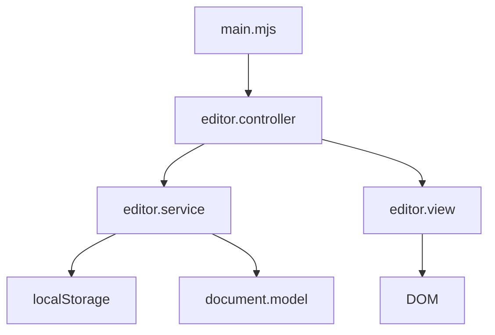

# betterEditor
## 1. 개요
- Rich_Text_Editor를 자바스크립트를 통해 개발
  - 프론트 엔드 교육을 통해 배운 지식을 활용하여 개인 프로젝트를 진행
  - 기간 : 4월 27일 ~ 5월 24일
  - MVC 설계 기반으로 개발 진행
  - ESM 이용하여 개발
  - SPA(Single Page Application)
  - 프레임워크 사용 X
  - 핵심 비지니스 로직에 대한 unit test 필요
    - mocha 프레임워크 사용

## 2. 개발 환경 구성
https://html5boilerplate.com/  사용

## 3. 설계
  - 모듈 의존성 다이어그램 (ESM)


## 4. 기능 목록 정리

    a. text-editor 안에 들어갈 기능
      - 왼쪽 정렬
      - 가운데 정렬
      - 오른쪽 정렬
      - 텍스트 진하게(Bold)
      - 텍스트 기울이기(Italic)
      - 텍스트 언더라인(Underline)
      - 순서 리스트, 순서X 리스트 (동그란 점)
      - 하이퍼 링크

    b. 심화기능
      - 편집 시 중간에 브라우저를 껐다가 켜도 다시 이어서 편집할 수 있도록 구현
      - localStorage 사용

    c. 모든 기능들은 Model을 사용하며 렌더링할 경우 모델에 저장된 데이터를 가져와 렌더링

## 5. Usage
1. 구동 전 필요한 절차
```
// 필요한 npm 설치
npm i

// parcel build index.html 진행
npm run bulid

// index.html start
npm run dev
```
3. Unit Test 실행 방법
```
// 유닛 테스트 실행
npm test

```


